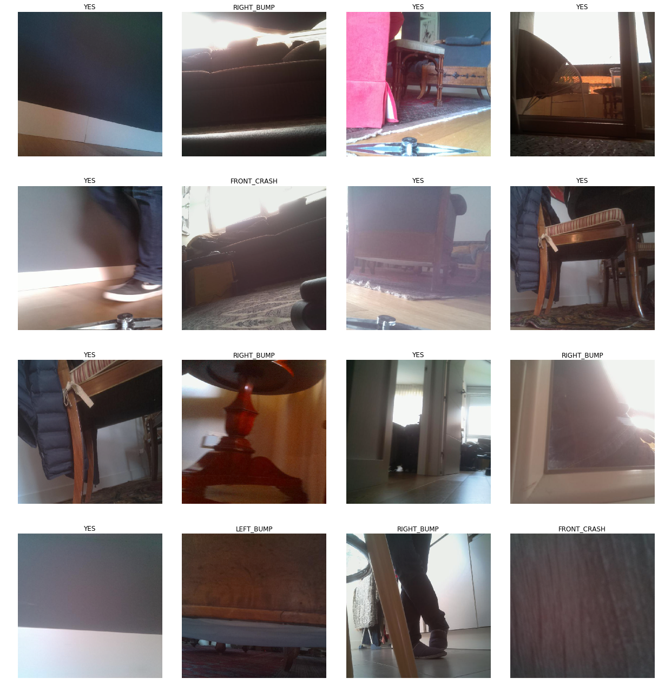
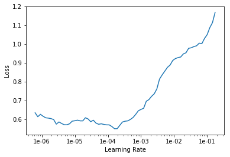
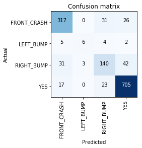
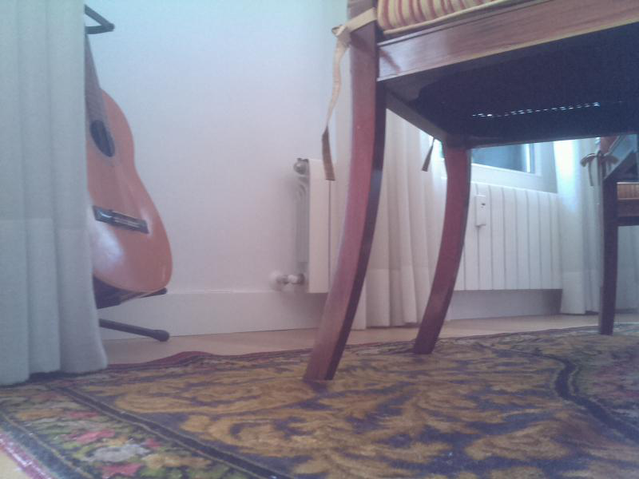
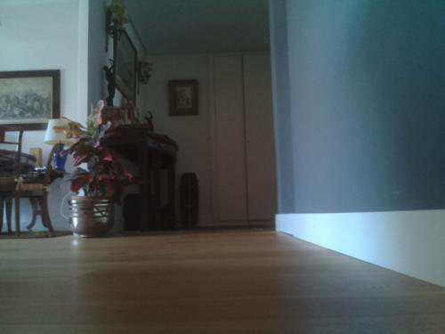
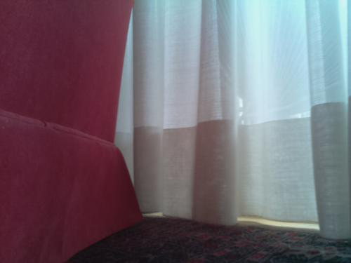

```python
from fastai.vision import *
```

Neuronal network for roomba by Mariano Miretta, using fastai

Dataset creation with roomba bumper


```python
path = Path('/root/JupyterNotebooks/roomba/livingroom2/dataset_from_roomba')

path.ls()
```


    [PosixPath('/root/JupyterNotebooks/roomba/livingroom2/dataset_from_roomba/export.pkl'),
     PosixPath('/root/JupyterNotebooks/roomba/livingroom2/dataset_from_roomba/FRONT_CRASH'),
     PosixPath('/root/JupyterNotebooks/roomba/livingroom2/dataset_from_roomba/LEFT_BUMP'),
     PosixPath('/root/JupyterNotebooks/roomba/livingroom2/dataset_from_roomba/RIGHT_BUMP'),
     PosixPath('/root/JupyterNotebooks/roomba/livingroom2/dataset_from_roomba/YES'),
     PosixPath('/root/JupyterNotebooks/roomba/livingroom2/dataset_from_roomba/models')]


```python
classes = ['YES','FRONT_CRASH','LEFT_BUMP','RIGHT_BUMP']
```

delete all the files that we cannot read


```python
for c in classes:
    print(c)
    verify_images(path/c, delete=True, max_size=1024)
```

    YES


    <div>
        <style>
            /* Turns off some styling */
            progress {
                /* gets rid of default border in Firefox and Opera. */
                border: none;
                /* Needs to be in here for Safari polyfill so background images work as expected. */
                background-size: auto;
            }
            .progress-bar-interrupted, .progress-bar-interrupted::-webkit-progress-bar {
                background: #F44336;
            }
        </style>
      <progress value='3794' class='' max='3794', style='width:300px; height:20px; vertical-align: middle;'></progress>
      100.00% [3794/3794 00:11<00:00]
    </div>
    


    FRONT_CRASH


    <div>
        <style>
            /* Turns off some styling */
            progress {
                /* gets rid of default border in Firefox and Opera. */
                border: none;
                /* Needs to be in here for Safari polyfill so background images work as expected. */
                background-size: auto;
            }
            .progress-bar-interrupted, .progress-bar-interrupted::-webkit-progress-bar {
                background: #F44336;
            }
        </style>
      <progress value='1760' class='' max='1760', style='width:300px; height:20px; vertical-align: middle;'></progress>
      100.00% [1760/1760 00:12<00:00]
    </div>
    


    LEFT_BUMP


    <div>
        <style>
            /* Turns off some styling */
            progress {
                /* gets rid of default border in Firefox and Opera. */
                border: none;
                /* Needs to be in here for Safari polyfill so background images work as expected. */
                background-size: auto;
            }
            .progress-bar-interrupted, .progress-bar-interrupted::-webkit-progress-bar {
                background: #F44336;
            }
        </style>
      <progress value='104' class='' max='104', style='width:300px; height:20px; vertical-align: middle;'></progress>
      100.00% [104/104 00:00<00:00]
    </div>
    


    RIGHT_BUMP


    <div>
        <style>
            /* Turns off some styling */
            progress {
                /* gets rid of default border in Firefox and Opera. */
                border: none;
                /* Needs to be in here for Safari polyfill so background images work as expected. */
                background-size: auto;
            }
            .progress-bar-interrupted, .progress-bar-interrupted::-webkit-progress-bar {
                background: #F44336;
            }
        </style>
      <progress value='1104' class='' max='1104', style='width:300px; height:20px; vertical-align: middle;'></progress>
      100.00% [1104/1104 00:05<00:00]
    </div>
    


```python

```


```python
bs=16

#def _flip_affine() -> TfmAffine:
#    "Flip `x` horizontally."
 #   return [[-1, 0, 0.],
  #          [0,  1, 0],
   #         [0,  0, 1.]]
#flip_affine = TfmAffine(_flip_affine)

np.random.seed(42)
data = ImageDataBunch.from_folder(path, train=".", valid_pct=0.2,
        ds_tfms=get_transforms(), size=640,bs=bs, num_workers=2).normalize(imagenet_stats)
```


```python
data.classes
```


    ['FRONT_CRASH', 'LEFT_BUMP', 'RIGHT_BUMP', 'YES']


```python
##data.show_batch()
#tfms = get_transforms(max_rotate=25); len(tfms#)
```


```python
data.show_batch(rows=7, figsize=(17,18))
```





```python

```


```python

```


```python
data.classes, data.c, len(data.train_ds), len(data.valid_ds)
```


    (['FRONT_CRASH', 'LEFT_BUMP', 'RIGHT_BUMP', 'YES'], 4, 5410, 1352)


```python
learn = create_cnn(data, models.resnet34, metrics=error_rate)

#To enable on both GPUs
learn.model = nn.DataParallel(learn.model, device_ids=[0, 1])
#learn.model
```


```python
 learn.fit_one_cycle(12)
```


Total time: 47:21 <p><table border="1" class="dataframe">
  <thead>
    <tr style="text-align: left;">
      <th>epoch</th>
      <th>train_loss</th>
      <th>valid_loss</th>
      <th>error_rate</th>
      <th>time</th>
    </tr>
  </thead>
  <tbody>
    <tr>
      <td>1</td>
      <td>1.148557</td>
      <td>0.796722</td>
      <td>0.306953</td>
      <td>03:58</td>
    </tr>
    <tr>
      <td>2</td>
      <td>0.916633</td>
      <td>0.724713</td>
      <td>0.282544</td>
      <td>03:57</td>
    </tr>
    <tr>
      <td>3</td>
      <td>0.887446</td>
      <td>0.718112</td>
      <td>0.262574</td>
      <td>03:56</td>
    </tr>
    <tr>
      <td>4</td>
      <td>0.847031</td>
      <td>0.631110</td>
      <td>0.230769</td>
      <td>03:56</td>
    </tr>
    <tr>
      <td>5</td>
      <td>0.764337</td>
      <td>0.599229</td>
      <td>0.222633</td>
      <td>03:56</td>
    </tr>
    <tr>
      <td>6</td>
      <td>0.760102</td>
      <td>0.562863</td>
      <td>0.215976</td>
      <td>03:56</td>
    </tr>
    <tr>
      <td>7</td>
      <td>0.658750</td>
      <td>0.540209</td>
      <td>0.207840</td>
      <td>03:57</td>
    </tr>
    <tr>
      <td>8</td>
      <td>0.642802</td>
      <td>0.481386</td>
      <td>0.163462</td>
      <td>03:56</td>
    </tr>
    <tr>
      <td>9</td>
      <td>0.621693</td>
      <td>0.492348</td>
      <td>0.180473</td>
      <td>03:57</td>
    </tr>
    <tr>
      <td>10</td>
      <td>0.576502</td>
      <td>0.457849</td>
      <td>0.155325</td>
      <td>03:56</td>
    </tr>
    <tr>
      <td>11</td>
      <td>0.604046</td>
      <td>0.456322</td>
      <td>0.158284</td>
      <td>03:56</td>
    </tr>
    <tr>
      <td>12</td>
      <td>0.599447</td>
      <td>0.452852</td>
      <td>0.162722</td>
      <td>03:55</td>
    </tr>
  </tbody>
</table>


```python
learn.save('stage-1')
```


```python
learn.load('stage-1')
learn.unfreeze()

```


```python
learn.lr_find()
```


    LR Finder is complete, type {learner_name}.recorder.plot() to see the graph.


```python
learn.recorder.plot()
```





```python
learn.fit_one_cycle(2, max_lr=slice(1e-5,1e-4))

#learn.model = nn.DataParallel(learn.model, device_ids=[1])
```


Total time: 08:23 <p><table border="1" class="dataframe">
  <thead>
    <tr style="text-align: left;">
      <th>epoch</th>
      <th>train_loss</th>
      <th>valid_loss</th>
      <th>error_rate</th>
      <th>time</th>
    </tr>
  </thead>
  <tbody>
    <tr>
      <td>1</td>
      <td>0.589669</td>
      <td>0.422360</td>
      <td>0.150888</td>
      <td>04:24</td>
    </tr>
    <tr>
      <td>2</td>
      <td>0.545735</td>
      <td>0.392712</td>
      <td>0.136095</td>
      <td>03:59</td>
    </tr>
  </tbody>
</table>


```python
learn.save('stage-2')
```

Interpretation


```python
learn.load('stage-2');
```


```python
interp = ClassificationInterpretation.from_learner(learn)

```


```python
interp.plot_confusion_matrix()
```





```python
#interp = ClassificationInterpretation.from_learner(learn)

#interp.plot_top_losses(9, figsize=(15, 11))htop

```

# Now, let's do some real testing


```python
#Export the model for production
learn.export()
data.classes
```


    ['FRONT_CRASH', 'LEFT_BUMP', 'RIGHT_BUMP', 'YES']


```python
defaults.device = torch.device('cuda')
```


```python
img = open_image('/root/JupyterNotebooks/roomba/livingroom/NO/2019-03-27 13:36:43.509640_no.jpg')
img
```





```python
learn = load_learner(path)

print (path)
```

    /root/JupyterNotebooks/roomba/livingroom2/dataset_from_roomba


```python
pred_class,pred_idx,outputs = learn.predict(img)

print (pred_class)
print (pred_idx)
print (outputs)
```

    FRONT_CRASH
    tensor(0)
    tensor([0.8356, 0.0082, 0.0865, 0.0696])


```python
#Let's take an image from other day and at different resolution.
```


```python
img = open_image('/root/JupyterNotebooks/roomba/SI/2019-03-19 15:49:04.437812_si.jpg')
img


```





```python
pred_class,pred_idx,outputs = learn.predict(img)

print (pred_class)
print (pred_idx)
print (outputs)
```

    YES
    tensor(3)
    tensor([1.2628e-02, 3.0800e-04, 7.3673e-03, 9.7970e-01])


```python
#and another one... different resolution and not part of this training set  
img = open_image('/root/JupyterNotebooks/roomba/NO/2019-03-19 16:16:34.340064_no.jpg')
img
```





```python
pred_class,pred_idx,outputs = learn.predict(img)

print (pred_class)
print (pred_idx)
print (outputs)
```

    FRONT_CRASH
    tensor(0)
    tensor([0.7462, 0.0048, 0.0486, 0.2005])


```python
img = open_image('/root/JupyterNotebooks/roomba/NO/2019-03-19 16:22:07.487264_no.jpg')
img

```


```python
pred_class,pred_idx,outputs = learn.predict(img)

print (pred_class)
print (pred_idx)
print (outputs)
```

    FRONT_CRASH
    tensor(0)
    tensor([9.4754e-01, 4.4922e-04, 1.5409e-02, 3.6597e-02])


```python

```


```python

```


```python

```


```python

```


```python

```


```python

```


```python

```
